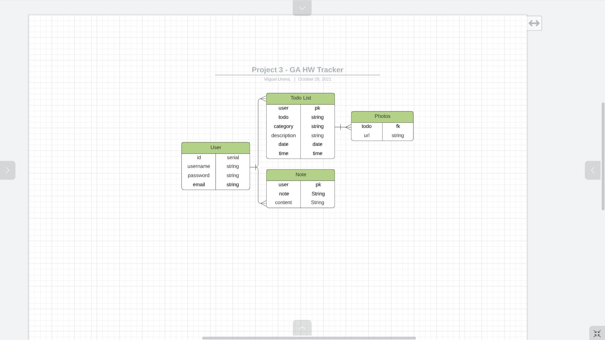
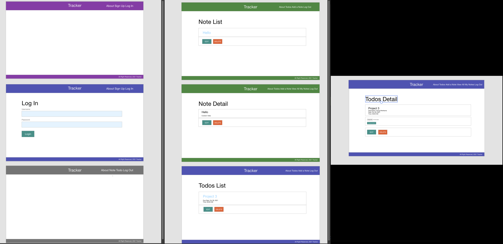

 <h1 align="center">TRACKER </h1>

by Amar Panjwani, Miguel Urena, and Navid Yazdani

## <h2 align="center">https://gatracker.herokuapp.com/

## Description
Tracker is a hub where GA software engineering students can track their current homework assignments and their corresponding due dates using todo lists and notes.

## Screenshots
| Description | Screenshot |
|------------ | ------------|
| ERD | 
| Wireframes | 
| Home Page | 
| Todos List | 
| Todo Details | 
| Add a Note | 

## Technologies Used
Python | Django | PostgreSQL | AWS | Heroku | HTML | CSS

## Getting Started
1. Test
2.
3.

#### Trello Board: https://trello.com/b/PUkOSwTq/tracker-project-3

#### Pitch-Deck: https://docs.google.com/presentation/d/1h2wwLEPFEW8QYUVp-uX2hn5afxvE5GVZatkmLsMW-J4/edit?usp=sharing

## Next Steps
+ Add sync functionality with Outcomes Google Classroom assignments
+ Add sync functionality with Google Calendar
+ 

